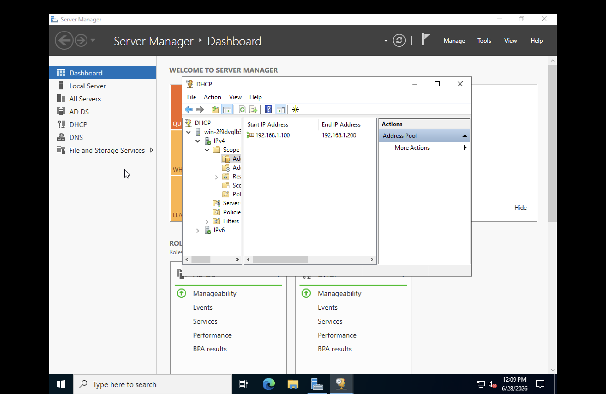
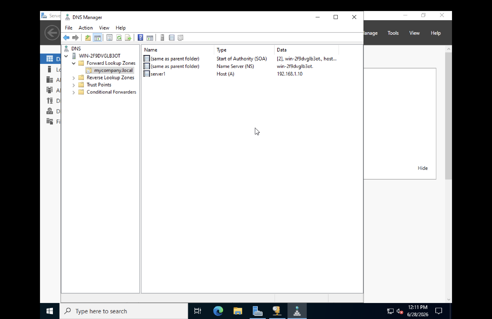
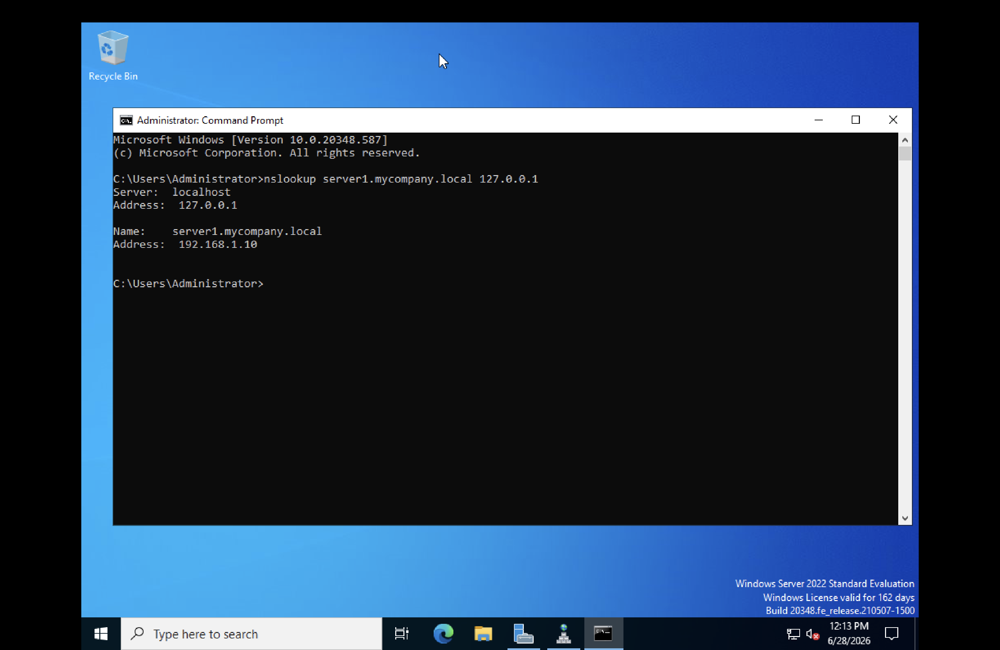

# Lab 1 — DHCP, DNS and File Server Configuration

**Date:** June 2026
**Platform:** Windows Server 2022 Standard Evaluation, UTM on macOS (M3)

---

## Objective

Install and configure three core Windows Server roles: DHCP Server, DNS Server, and File Server.

---

## Environment

| Component | Details |
|---|---|
| Host Machine | MacBook Air M3 (8GB RAM) |
| Virtualisation | UTM (ARM emulation) |
| Guest OS | Windows Server 2022 Standard Evaluation |
| Network | NAT via UTM |

---

## Part 1 — DHCP Server

DHCP automatically assigns IP addresses to devices joining a network, eliminating the need for manual configuration on each device.

| Setting | Value |
|---|---|
| Scope Name | MyFirstScope |
| Start IP | 192.168.1.100 |
| End IP | 192.168.1.200 |
| Subnet Mask | 255.255.255.0 |
| Status | Active |

DHCP server operational. Devices joining the network will automatically receive an address from the configured pool.

---

## Part 2 — DNS Server

DNS resolves hostnames to IP addresses. An internal DNS zone was created for the company domain, an A record was added and verified.

| Setting | Value |
|---|---|
| Zone Name | mycompany.local |
| Record Name | server1 |
| Record Type | Host (A) |
| IP Address | 192.168.1.10 |

Initial nslookup failed because the adapter was using an external IPv6 DNS by default. Fixed by setting preferred DNS to 127.0.0.1 in adapter properties.

Verification command: nslookup server1.mycompany.local 127.0.0.1

Result: server1.mycompany.local resolved to 192.168.1.10

---

## Part 3 — File Server

A file server hosts shared folders accessible to users across the network via UNC paths.

Created folder C:\CompanyFiles and enabled sharing via folder Properties > Sharing > Advanced Sharing.

Accessed via: \\127.0.0.1\CompanyFiles — folder opened successfully over the network.

---

## What I Learned

Configuring DHCP and DNS on an actual server made networking theory much more concrete. The DNS troubleshooting — identifying that IPv6 was taking priority over localhost — was a practical lesson that would not come from reading alone.

## Challenges

| Issue | Resolution |
|---|---|
| x64 ISO boot looping on M3 Mac | Switched to UTM emulation mode |
| nslookup returning non-existent domain | Set preferred DNS to 127.0.0.1 in adapter settings |
