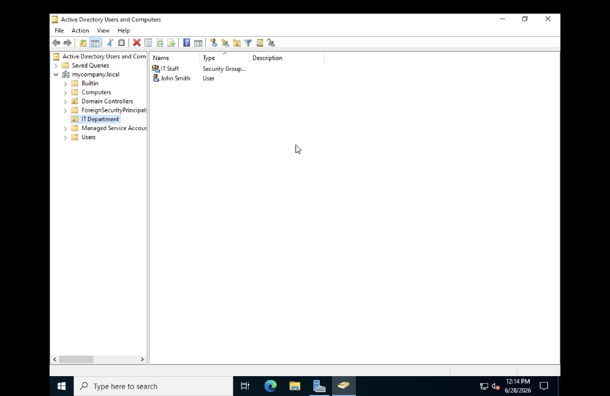

# Lab 2 — Active Directory, Domain Controller, Users and Groups

**Date:** June 2026
**Platform:** Windows Server 2022 Standard Evaluation, UTM on macOS (M3)

---

## Objective

Install Active Directory Domain Services, promote the server to a Domain Controller, and configure Organisational Units, user accounts, and security groups.

---

## Key Concepts

| Workgroup | Domain |
|---|---|
| No central control | Centralised control via Domain Controller |
| Each PC manages its own accounts | One account works on all machines |
| Home networks | Used by every enterprise |

---

## Steps

### 1. Install AD DS Role

Installed Active Directory Domain Services via Server Manager.

### 2. Promote to Domain Controller

Selected Add a new forest, set root domain name to mycompany.local. Server restarted automatically. Login screen showed MYCOMPANY\Administrator confirming AD is active.

### 3. Create Organisational Unit

Right clicked mycompany.local > New > Organizational Unit, named it IT Department.

### 4. Create User Account

| Field | Value |
|---|---|
| First Name | John |
| Last Name | Smith |
| Logon Name | jsmith |
| Password Never Expires | Yes |

### 5. Create Security Group

| Field | Value |
|---|---|
| Group Name | IT Staff |
| Scope | Global |
| Type | Security |

### 6. Add User to Group

Opened IT Staff > Members tab > Add > searched jsmith > confirmed.

---

## What I Learned

The difference between a workgroup and a domain becomes clear when you actually build one. Organisational Units make large-scale user management practical — without them, administering hundreds of accounts in a flat structure would be unworkable.

## Challenges

| Issue | Resolution |
|---|---|
| Server restarted mid-promotion | Expected — AD DS promotion requires a restart |
