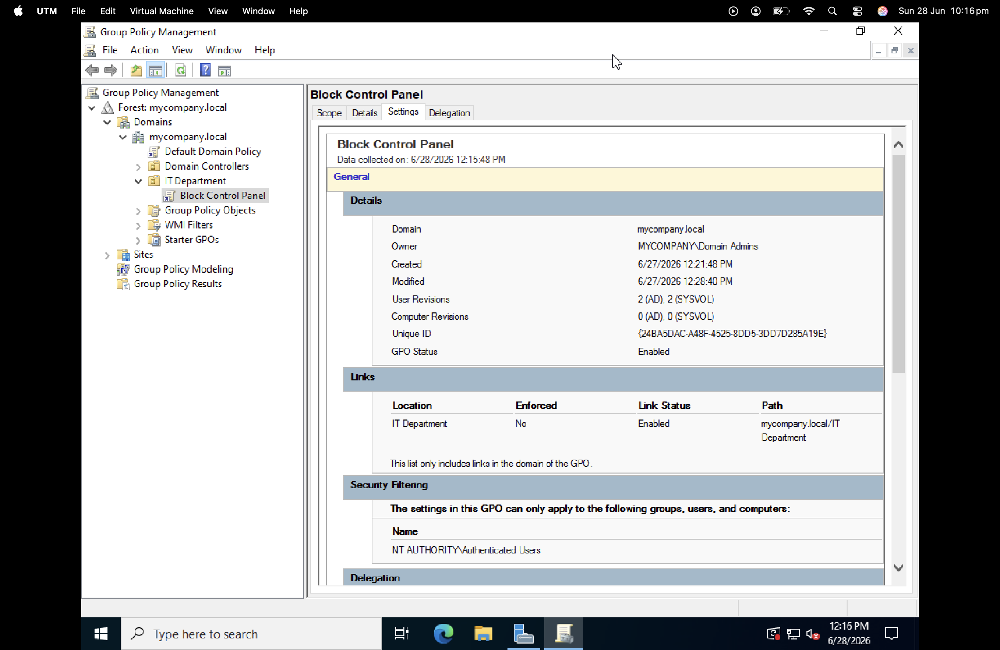

# Lab 3 — Group Policy Object (GPO) Configuration

**Date:** June 2026
**Platform:** Windows Server 2022 Standard Evaluation, UTM on macOS (M3)

---

## Objective

Create a GPO that restricts Control Panel access for users in the IT Department OU and verify it is correctly applied.

---

## Key Concepts

Group Policy allows administrators to enforce configuration settings across all users and computers on a domain from one location. One change on the server propagates automatically — no manual configuration per device needed.

---

## Steps

### 1. Create and Link GPO

Right clicked IT Department > Create a GPO in this domain and Link it here, named it Block Control Panel.

### 2. Configure the Policy

Navigated to User Configuration > Policies > Administrative Templates > Control Panel. Opened Prohibit access to Control Panel and PC settings and set to Enabled.

### 3. Push Policy Update

Ran gpupdate /force in Command Prompt. Output confirmed update completed successfully.

### 4. Verify GPO Status

| Field | Value |
|---|---|
| GPO Status | Enabled |
| Linked To | IT Department |
| Path | mycompany.local/IT Department |
| Owner | MYCOMPANY\Domain Admins |

---

## What I Learned

A GPO is just a container — it does nothing until policy settings are configured inside it and linked to an OU. The Administrator account is always exempt from restrictive policies by design, preventing accidental server lockout.

## Challenges

| Issue | Resolution |
|---|---|
| Control Panel still opened during testing | Administrator is exempt from GPOs by design |
| gpresult showed no RSoP data for jsmith | Expected — data only exists after user logs in |

## Next Steps

- Join a Windows 10/11 client VM to mycompany.local
- Log in as jsmith
- Confirm Control Panel is blocked
- Run gpresult /r to view applied policies
