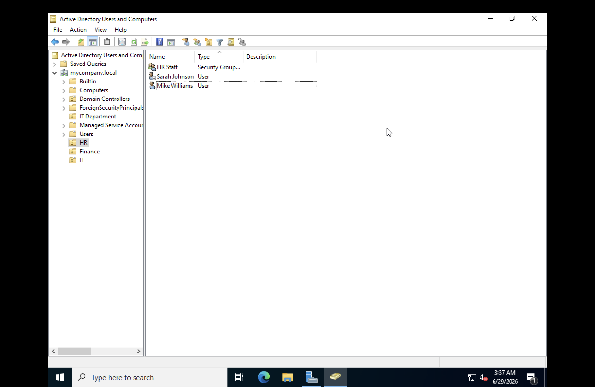
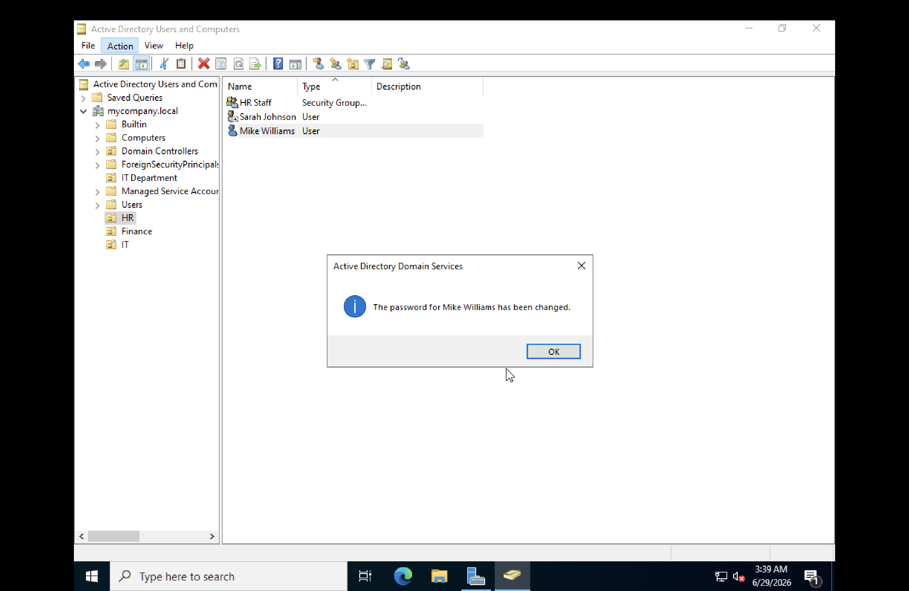
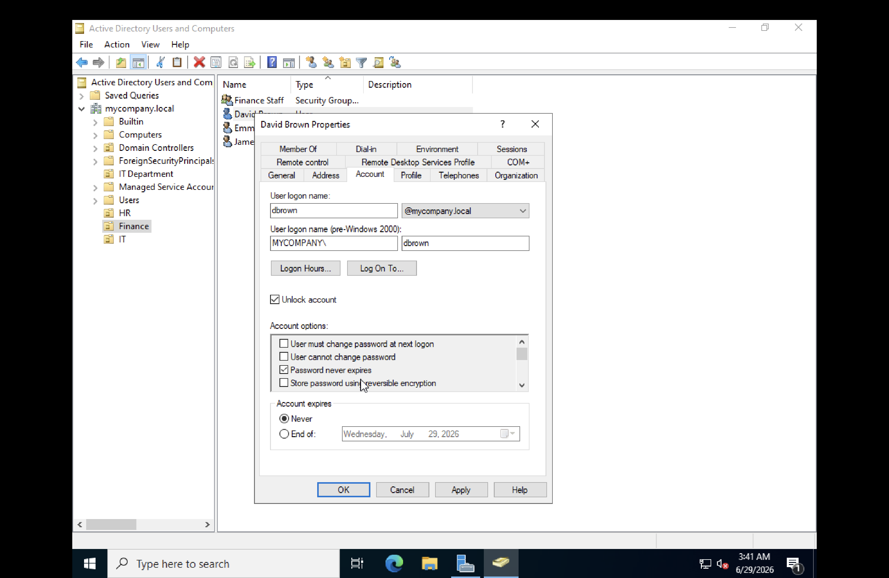
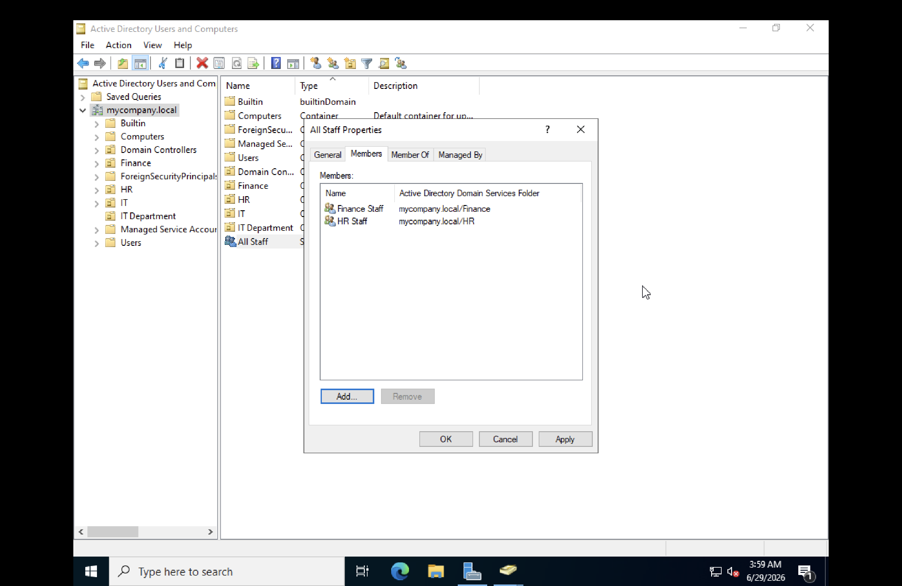
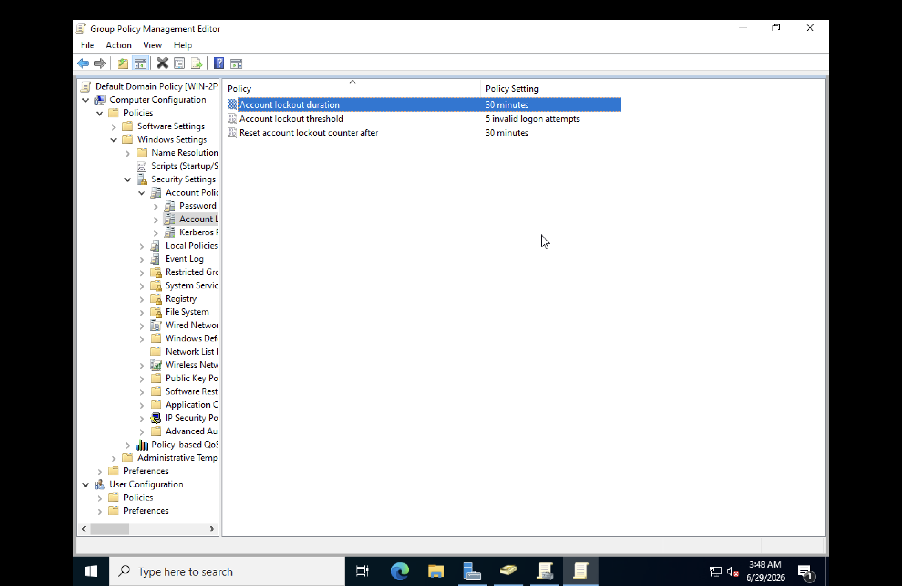

# Lab 4 — Domain Administration, User Lifecycle and Group Policy

**Date:** June 2026
**Platform:** Windows Server 2022 Standard Evaluation, UTM on macOS (M3)

---

## Objective

Perform common domain administration tasks including user and group management, account lifecycle operations, nested groups, and domain-wide password and lockout policies.

---

## Key Concepts

### User Lifecycle

Every user account in Active Directory goes through three stages:

- Onboarding — account created, placed in correct OU, added to security groups
- Modification — department change, password reset, access updated
- Offboarding — account disabled first, deleted after a retention period (typically 30 days)

Accounts are always disabled before deletion. The mailbox and files may still be needed after the employee leaves.

### Security Groups vs Distribution Groups

| Security Group | Distribution Group |
|---|---|
| Controls access to files, folders, and GPOs | Used for email lists only |
| Can be assigned permissions | Cannot be assigned permissions |
| Used throughout this lab | Used in Exchange/Microsoft 365 environments |

### Nested Groups

A group can be placed inside another group. Members of the inner group automatically inherit the permissions of the outer group. This allows scalable permission management — instead of adding hundreds of users individually, you nest department groups inside a broader group.

### Computer Objects

When a Windows machine joins a domain it automatically appears in the Computers container in Active Directory. Admins can apply GPOs to computer objects, track domain-joined machines, and manage them centrally.

---

## Lab Steps

### 1. Create Organisational Units

Created three OUs under mycompany.local:
- HR
- Finance
- IT

### 2. Create User Accounts

Created 10 users across the three OUs:

**HR OU**

| Name | Logon Name |
|---|---|
| Sarah Johnson | sjohnson |
| Mike Williams | mwilliams |

**Finance OU**

| Name | Logon Name |
|---|---|
| David Brown | dbrown |
| Emma Davis | edavis |
| James Wilson | jwilson |

**IT OU**

| Name | Logon Name |
|---|---|
| Alex Taylor | ataylor |
| Lisa Anderson | landerson |
| Chris Martin | cmartin |
| Rachel Thompson | rthompson |
| Tom White | twhite |

### 3. Create Security Groups

Created one security group per department inside the matching OU:

| Group Name | OU |
|---|---|
| HR Staff | HR |
| Finance Staff | Finance |
| IT Staff | IT |

### 4. Assign Users to Groups

Added each user to their department security group via the Members tab on each group.

### 5. Disable an Account

Simulated employee offboarding by disabling sjohnson's account.

Right clicked sjohnson > Disable Account. A down arrow appeared on the user icon confirming the account is disabled.

### 6. Reset a Password

Simulated a helpdesk password reset request for mwilliams.

Right clicked mwilliams > Reset Password > set new temporary password.

### 7. Unlock an Account

Simulated unlocking dbrown's account after repeated failed login attempts.

Right clicked dbrown > Properties > Account tab > ticked Unlock account.

### 8. Nested Groups

Created a new group called All Staff at the domain level. Added HR Staff and Finance Staff as members, demonstrating nested group inheritance.

### 9. Password Policy

Configured domain-wide password policy via Default Domain Policy GPO:

| Setting | Value |
|---|---|
| Minimum password length | 8 characters |
| Password must meet complexity requirements | Enabled |
| Maximum password age | 90 days |
| Minimum password age | 1 day |

### 10. Account Lockout Policy

Configured account lockout policy to protect against brute force attacks:

| Setting | Value |
|---|---|
| Account lockout threshold | 5 invalid logon attempts |
| Account lockout duration | 30 minutes |
| Reset account lockout counter after | 30 minutes |

---

## What I Learned

Managing user accounts at scale requires structure — OUs organise users logically, security groups assign permissions efficiently, and nested groups allow inheritance so permissions scale without manual overhead. The account lifecycle tasks (disable, reset, unlock) are the most common day-to-day helpdesk operations in any Windows environment. Password and lockout policies are the first line of defence against unauthorised access and brute force attacks.

## Challenges

| Issue | Resolution |
|---|---|
| Could not tick "must change password at next logon" | Conflicted with "password never expires" set during user creation — expected behaviour |

---

## Interview Question

**"How do you onboard a new employee in Active Directory?"**

Create a user account in Active Directory and place it in the correct OU for their department. Add the account to the appropriate security group so it inherits the right folder permissions and Group Policy settings. Set a temporary password and force a password change at first logon. Communicate credentials to the user through a secure channel.
