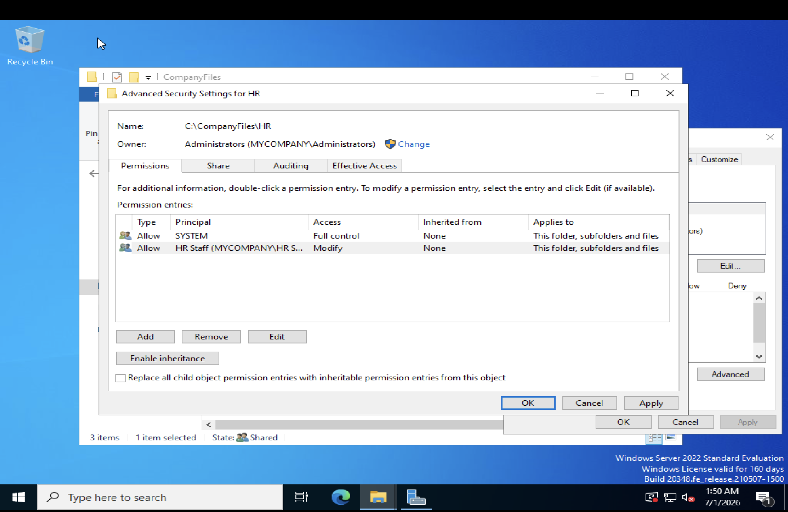
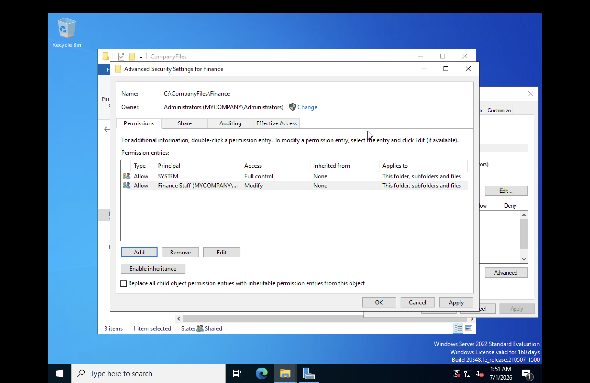
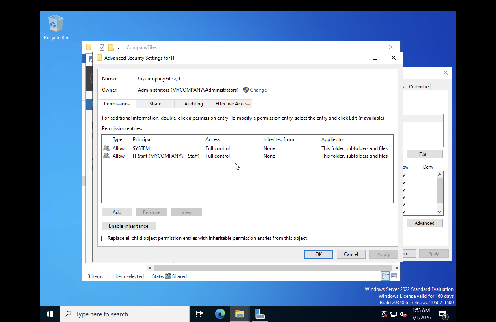
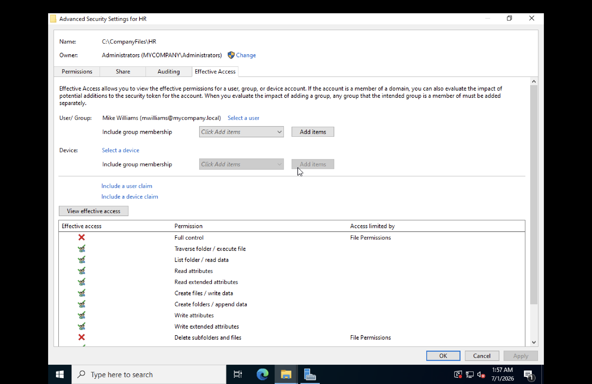

# Lab 5 — NTFS Permissions and Shared Folders

**Date:** July 2026
**Platform:** Windows Server 2022 Standard Evaluation, UTM on macOS (M3)

---

## Objective

Configure NTFS and Share permissions on a shared folder structure so each department can only access their own folder, while IT has full access to everything.

---

## Key Concepts

### Share Permissions

Apply only when accessing a folder over the network via a UNC path such as \\servername\foldername. Three options: Read, Change, Full Control. Do not apply when accessing locally at the machine.

### NTFS Permissions

Apply everywhere — both over the network and locally on the machine. Work at the file system level on the disk. More granular options: Read, Write, Modify, Full Control, List Folder Contents, Read and Execute.

### The Most Restrictive Rule

When both Share and NTFS permissions apply, Windows gives the user whichever is more restrictive. If Share says Full Control but NTFS says Read, the user gets Read only.

### Inheritance

NTFS permissions flow down from parent folder to subfolders automatically. This can be broken on individual subfolders so they have their own independent permissions — which is what this lab does.

### Best Practice

Set Share permissions to Full Control for Everyone and use NTFS permissions to do all real access control. This simplifies management — only one set of rules to think about.

---

## Folder Structure

C:\CompanyFiles
├── HR
├── Finance
└── IT

---

## Steps

### 1. Create Folder Structure

Created HR, Finance, and IT subfolders inside C:\CompanyFiles.

### 2. Configure Share Permissions

Right clicked CompanyFiles > Properties > Sharing > Advanced Sharing > Permissions. Set Everyone to Full Control. This opens the front door — NTFS handles the real restrictions.

### 3. HR Folder — NTFS Permissions

1. Right clicked HR > Properties > Security > Advanced
2. Clicked Disable Inheritance > Convert inherited permissions
3. Removed all entries except SYSTEM
4. Added HR Staff group with Modify permission

### 4. Finance Folder — NTFS Permissions

1. Right clicked Finance > Properties > Security > Advanced
2. Clicked Disable Inheritance > Convert inherited permissions
3. Removed all entries except SYSTEM
4. Added Finance Staff group with Modify permission

### 5. IT Folder — NTFS Permissions

1. Right clicked IT > Properties > Security > Advanced
2. Clicked Disable Inheritance > Convert inherited permissions
3. Removed all entries except SYSTEM
4. Added IT Staff group with Full Control

IT gets Full Control because they need unrestricted access for support purposes.

### 6. Verify Using Effective Access

Used the Effective Access tab to verify mwilliams (HR Staff member) has correct permissions on the HR folder without needing to log in as that user.

Result: mwilliams has Read, List, Write, Create files and folders — confirming Modify access is working. Full Control and Delete subfolders are blocked as expected.

---

## Permission Summary

| Folder | Group | Permission |
|---|---|---|
| HR | HR Staff | Modify |
| Finance | Finance Staff | Modify |
| IT | IT Staff | Full Control |

---

## What I Learned

The difference between Share and NTFS permissions is one of the most practical concepts in Windows administration. Setting Share to Full Control and controlling everything through NTFS is the standard approach in real environments because it keeps permission management in one place. Breaking inheritance on subfolders is what allows each department to have isolated access — without it, permissions from the parent folder would flow down to everyone.

## Challenges

| Issue | Resolution |
|---|---|
| Effective Access showed incomplete results for sjohnson | Account was disabled — tested with active user mwilliams instead |
